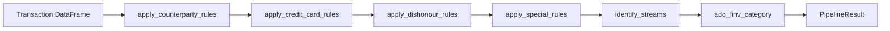

# Liability Classification Engine

The liability engine is a first-class package. It implements the shared engine
protocol directly in `engine.py` and can also run independently through its
package CLI.

The independent CLI reads the project root `sample.csv` by default.

## Package layout

```text
liability_classification_engine/
├─ cli.py
├─ engine.py
├─ pipeline.py
├─ domain/
│  ├─ counterparty.py
│  ├─ dishonours.py
│  ├─ special_rules.py
│  ├─ streams.py
│  └─ summary.py
├─ presentation/
│  ├─ dashboard.py
│  └─ reporting.py
└─ resources/
```

## Domain flow



`PipelineResult` contains the classified transactions and
explicit stream diagnostics.

The public API follows the shared convention: `run_pipeline()`,
`build_summary()`, and `write_report()`.

## Independent CLI

```powershell
python -m liability_classification_engine
```

The CLI accepts `--input`, `--output`, `--with-dashboard`, and
`--dashboard-output`.

## Project orchestration

`LiabilityEngine` receives only transactions that remain unclaimed after
higher-priority engines. It returns proposals using the common prediction
contract, and the project orchestrator commits accepted classifications.

## Resources

| File | Purpose |
| --- | --- |
| `resources/counterparty_keyword_rules.csv` | Counterparty and product rules |
| `resources/credit_card_rules.csv` | Credit-card and bank repayment overrides |
| `resources/dishonours_rules.csv` | Dishonour keyword and regex rules |
| `resources/bnpl_maximum_limits.csv` | BNPL summary assumptions |
