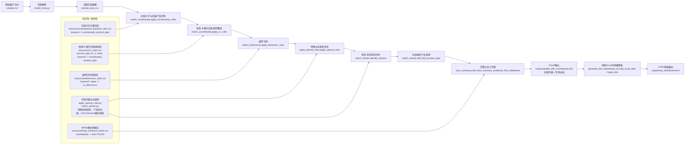
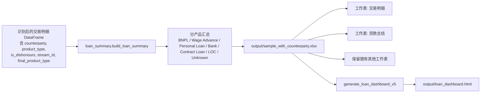

# 项目整体架构图

本文档基于当前代码结构生成，重点体现项目的知识库/规则库与银行流水识别流程。

## 1. 整体架构

## 2. 银行流水识别流程

```mermaid
flowchart TD
    A["输入流水记录<br/>user_id, application_id, bank_account_id,<br/>account_type, bank, transaction_date, amount,<br/>dr_cr, balance, text 等字段"] --> B["字段清理<br/>去除空列/Unnamed列"]

    B --> C["关键词匹配交易对手<br/>按 text 匹配 counterparty_keyword_rules.csv"]
    C --> D["写入 counterparty / product_type"]

    D --> E["信用卡/银行还款规则匹配<br/>按 account_type + dr_cr + bank + text<br/>匹配 cc_rules.csv"]
    E --> F["覆盖或补充 counterparty / product_type"]

    F --> G["退票识别<br/>按 dishonours_rules.csv 的 keyword / regex<br/>写入 is_dishonours = Yes/No"]

    G --> H["特殊规则修正<br/>Cash Converters、Credit Corp 等机构<br/>按金额、方向、文本进一步修正 product_type"]

    H --> I["按产品优先级分配 stream_id"]

    subgraph P["stream_id 识别优先级"]
        P1["1. BNPL<br/>bnpl_001..."]
        P2["2. Wage Advance<br/>wage_advance_001..."]
        P3["3. Bank / Credit Card Repayment<br/>bank_001..."]
        P4["4. Contract Loan<br/>contract_loan_001..."]
        P5["5. Personal Loan<br/>sacc_001 / non_sacc_001 / unknown_001..."]
        P6["6. LOC<br/>loc_001..."]
    end

    I --> P1 --> P2 --> P3 --> P4 --> P5 --> P6

    P5 --> Q["Personal Loan细分<br/>按 application_id + counterparty 分组<br/>借款入账 credit 与还款 debit 配对"]
    Q --> Q1["还款聚类<br/>按金额稳定性/容差聚类"]
    Q1 --> Q2["资金发放匹配<br/>匹配早于首次还款至少3天的 credit"]
    Q2 --> Q3["金额分层<br/>funding <= 2000 -> sacc<br/>funding > 2000 -> non_sacc<br/>无可匹配 funding -> unknown"]
    Q3 --> Q4["退票回挂<br/>dishonour credit 回挂到原还款 stream"]

    P6 --> R["LOC细化<br/>直接 loc 分组 + qualifying sacc 合并为 loc<br/>支持循环型/单笔 funding LOC 识别"]

    Q4 --> S["后处理"]
    R --> S
    S --> S1["unknown personal loan 细化<br/>按最近流、还款总额、账龄等规则改为 sacc / non_sacc / 既有 stream"]
    S1 --> S2["特殊交易对手流规则<br/>zip money / credit corp 等改写或合并 stream"]
    S2 --> S3["按 application_id 重新编号<br/>保证 stream_id 稳定连续"]
    S3 --> T["生成 final_product_type<br/>如 personal_loan_sacc、personal_loan_non_sacc、loc、bnpl"]
```

## 3. 产出链路

## 4. 模块职责速览

| 模块 | 主要职责 | 关键输入 | 关键输出 |
| --- | --- | --- | --- |
| `model_main.py` | 主流程编排，串联识别、汇总、看板生成 | `sample.csv` | Excel工作簿、HTML看板 |
| `match_counterparty.py` | 基于关键词和信用卡规则识别交易对手、初始产品类型 | `counterparty_keyword_rules.csv`, `cc_rules.csv` | `counterparty`, `product_type` |
| `detect_dishonours.py` | 识别退票/失败还款交易 | `dishonours_rules.csv` | `is_dishonours` |
| `apply_special_rules.py` | 对特定机构和场景做产品类型修正 | 识别后的交易明细 | 修正后的 `product_type` |
| `match_stream.py` | 按产品优先级识别贷款流，生成并细化 `stream_id` | 带产品类型和退票标记的交易明细 | `stream_id`, `final_product_type` |
| `loan_summary.py` | 按贷款流生成分产品汇总指标 | 识别后的交易明细、`bnpl_maximum_limits.csv` | `贷款总结` |
| `generate_loan_dashboard_v5.py` | 将Excel结果转为HTML交互看板 | `sample_with_counterparty.xlsx` | `loan_dashboard.html` |
| `export.py` | 写入和格式化Excel工作簿 | 交易明细、贷款总结 | 标准格式Excel |

## 5. 知识库清单

| 知识库/规则源 | 类型 | 在流程中的作用 |
| --- | --- | --- |
| `resources/counterparty_keyword_rules.csv` | 外部CSV规则 | 从交易文本识别交易对手和初始产品类型 |
| `resources/cc_rules.csv` | 外部CSV规则 | 对信用卡/银行还款类交易做更细粒度识别或覆盖 |
| `resources/dishonours_rules.csv` | 外部CSV规则 | 识别退票、失败扣款、reversal/direct debit dishonour 等交易 |
| `resources/bnpl_maximum_limits.csv` | 外部CSV参数 | 贷款总结阶段计算BNPL相关额度/指标 |
| `apply_special_rules.py` | 代码内置规则 | 处理 Cash Converters、Credit Corp 等无法仅靠关键词准确分类的场景 |
| `match_stream.py` | 代码内置规则 | 定义产品优先级、流编号规则、Personal Loan/LOC/unknown细化规则 |

