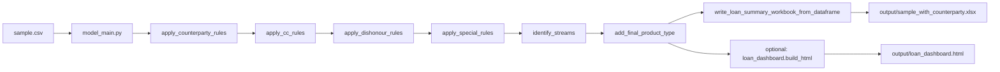

# Liability Classification Engine Architecture

本文档描述当前定版后的主流程。项目保留一个主入口 `model_main.py`，其它模块只暴露主流程需要的 DataFrame 级函数，不再保留旧 CSV/单模块 CLI 兼容入口。

## Main Flow

## Modules

| Module | Responsibility |
| --- | --- |
| `model_main.py` | Orchestrates the final pipeline and optional dashboard generation. |
| `match_counterparty.py` | Applies keyword and credit-card rules to set `counterparty` and initial `product_type`. |
| `detect_dishonours.py` | Marks dishonour/reversal transactions as `is_dishonours`. |
| `apply_special_rules.py` | Applies business-specific overrides that cannot be expressed cleanly in CSV rules. |
| `match_stream.py` | Assigns stream IDs by product priority and derives final product labels. |
| `loan_summary.py` | Builds loan-level summaries and writes the final workbook. |
| `export.py` | Formats generated Excel sheets. |
| `loan_dashboard.py` | Builds the optional single-file HTML dashboard from in-memory pipeline data. |

## Rule Files

| File | Purpose |
| --- | --- |
| `resources/counterparty_keyword_rules.csv` | Keyword rules for counterparty and product detection. |
| `resources/cc_rules.csv` | Credit-card/bank repayment overrides. |
| `resources/dishonours_rules.csv` | Dishonour keyword and regex rules. |
| `resources/bnpl_maximum_limits.csv` | BNPL maximum fortnightly repayment assumptions used by summaries. |

## Outputs

| Output | Generated By |
| --- | --- |
| `output/sample_with_counterparty.xlsx` | Default final workbook. |
| `output/loan_dashboard.html` | Optional dashboard when running `python model_main.py --with-dashboard`. |
